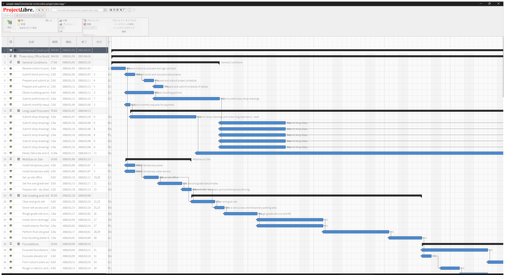
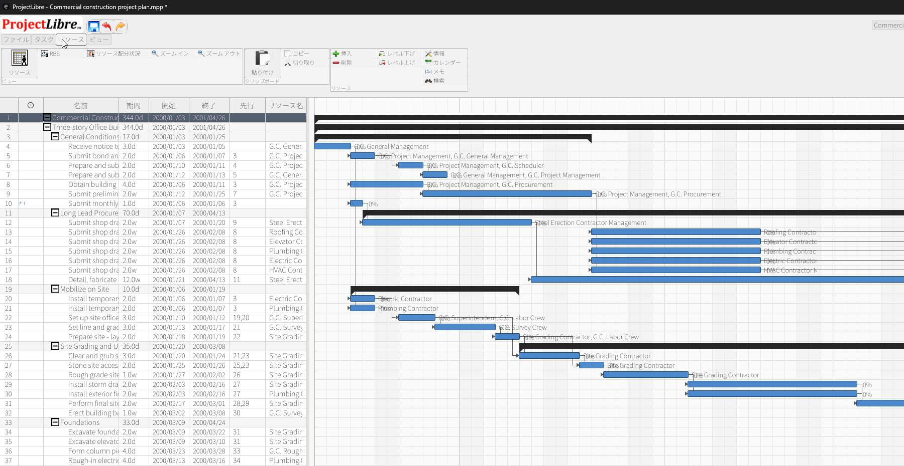
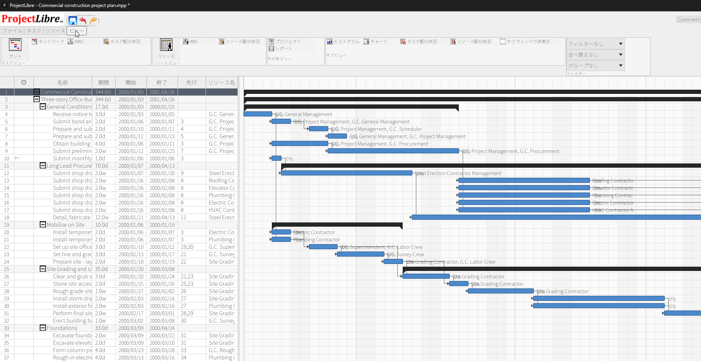

# ProjectLibre Gantt - Rust

This project is a Rust/egui rewrite of the ProjectLibre Gantt view, focused on keeping the task table, chart, and top chrome close to the original Java application.

## What it does

- Opens and renders `sample data/Commercial construction project plan.mpp`
- Shows the task table and Gantt chart side by side
- Imports MPP files through the Java bridge
- Preserves task hierarchy, dependencies, resource names, and timeline editing

## Run it

```bash
cargo run -- "sample data/Commercial construction project plan.mpp"
```

If no argument is passed, the app opens the bundled sample project by default.

## Screenshot



## Ribbon Parity

Latest Resource tab verification:



Latest View tab verification:



